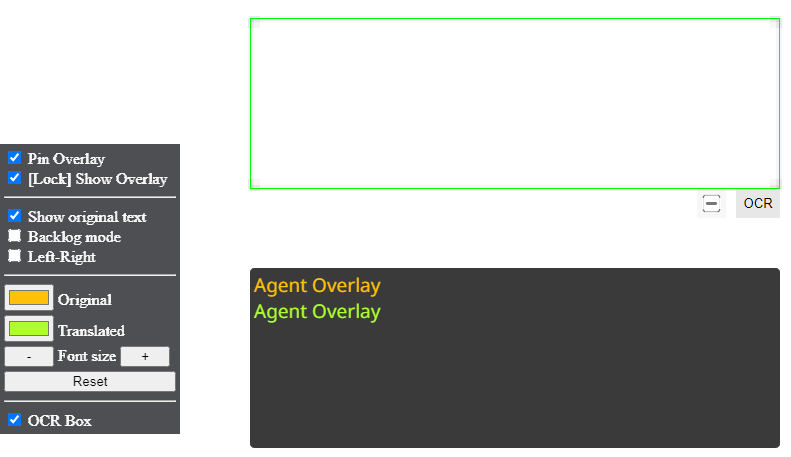
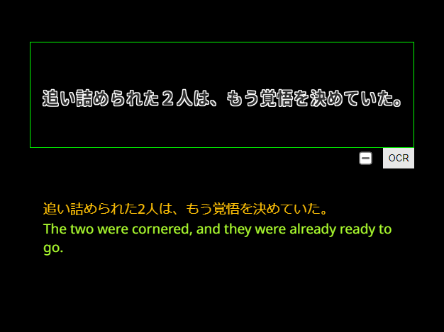

# OCR

:::info

Currently the OCR server is only supported on Windows (x64) and requires the Websocket setting to be enabled.

:::

Agent can OCR text using an OCR server. This is useful for signs or text in games that aren't hooked by the script.

## Setup

- Download the OCR server .zip file from the [latest GitHub release for Agent](https://github.com/0xDC00/agent/releases/latest).
- Extract the .zip file and run the `ocrServer.exe` file.
- A console window should open, and the OCR server is ready.

## Usage

Open Agent and press the keyboard shortcut to toggle the external overlay (defaults to `Ctrl+Alt+E`).

You should see the following pop up in the bottom left of your screen:

Press the shortcut to lock the external overlay (defaults to `Ctrl+Alt+D`).

You can resize the OCR box and overlay, or move them by holding the `Ctrl` key and dragging the edge of the box.

Whenever you want to OCR some text, click the OCR button at the bottom right of the OCR window. Once the OCR finishes, then the text will appear in the overlay:

