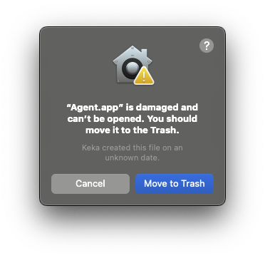

# Troubleshooting

Before troubleshooting further, first restart both Agent and your emulator or game, and attach before starting the game (for emulators).

## Agent is Not Hooking Text

If Agent is not hooking text for your game, please double check the following:

import Tabs from '@theme/Tabs';
import TabItem from '@theme/TabItem';

<Tabs className="tabs" queryString="platform">
  <TabItem value="emulators" label="Emulators">
    - Your scripts are up to date (update in the Agent UI).
    - You are using the [latest version](https://github.com/0xDC00/agent/releases/latest) of Agent.
    - You have selected the correct process and script for this game.
    - You have attached to the emulator after opening it and **before** launching a game.
    - The script's game ID matches your game. For example, if the script is for the Japanese version of the game, you should use the Japanese version.
    - You are using the correct version of the game specified by the script. For example, if the script is for version 1.0.2, you should use version 1.0.2 of the game.
  </TabItem>
  <TabItem value="pc" label="PC Games">
    - Your scripts are up to date (update in the Agent UI).
    - You are using the [latest version](https://github.com/0xDC00/agent/releases/latest) of Agent.
    - You have selected the correct process and script for this game.
    - Your game matches the game the script was created for (for example, if the script is for Steam, ensure that you have the game from Steam and not GOG).
  </TabItem>
</Tabs>

If all of these steps have been taken, and the game will still not hook text, please reach out to us [on Discord](https://discord.gg/sWeFsmJYJc).

## Module \<name\> not found!

```
Error: Module ./libYuzu.js not found!
```

If you see this error, it means the script you attached couldn't find its dependencies in the folder it's located in.

To fix this error, please make sure that the script is in `<agent_path>\data\scripts\`.

If a script is already in the scripts repository, you should just use the update button. 

## Unable to Find DLL

```
Unable to find DLL at 'C:\Users\...\AppData\Local\Temp\frida-fddab22b1574f0f686be62d756aa8aca\32\frida-agent.dll`
```

If you see this error, close all Agent windows and restart Agent, and ensure you only have one instance of Agent running.

## MergeNotSupportedError/FastForwardError

```
MergeNotSupportedError: Merges with conflicts are not supported yet.
```
```
FastForwardError: A simple fast-forward merge was not possible.
```

If you see either of these errors, delete the `data/scripts` directory at the root of your Agent installation folder and restart Agent.

## Agent.app is damaged (macOS)



macOS will sometimes quarantine .app files that are not downloaded from the App store. You can resolve this issue by opening the Terminal app and running the following command (assuming Agent.app is your `/Applications` folder):

```bash
xattr -c /Applications/Agent.app
```

## listen EADDRINUSE: address already in use

```
Error: listen EADDRINUSE: address already in use 127.0.0.1:9001
```

If you see this error, it means you either have two instances of agent open, or you have Textractor with TextractorSender plugin running. Since both programs can't create a WebSocket server on the same port, you will get this error.

You can resolve this issue by making sure you only have one instance of Agent running and by closing Textractor if it is opened.


## Emulated Realm Not Supported

```
Error: Emulated realm is not supported on this OS
```

If you see this error, you may have accidentally enabled the "Realms" setting on the Settings tab. Disable this setting and it should go away.

## Access Violation

```
Error: access violation accessing <address>
```

If you see this error, it can mean that you are using a version of the game that the script doesn't support. If you are using an emulated game, ensure that your game version matches the script's version. If this is a PC game, then please report this issue [on Discord](https://discord.gg/sWeFsmJYJc) or [create an issue](https://github.com/0xDC00/scripts/issues/new).

## Process not found

```
Process not found
```

This error is a Frida error, and it can happen on Linux if you didn't run agent with sudo.
